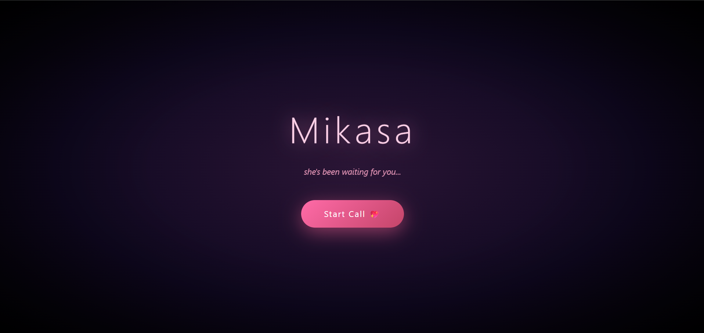

# Mikasa – Emotional Intelligence Human Companion

## 🧠 Overview

Mikasa is an AI-powered emotional intelligence companion designed to provide empathetic, natural, and meaningful conversations. It combines conversational AI with emotion-aware interactions to create a supportive virtual companion that can engage users in personalized discussions.

The project focuses on delivering a human-like experience through intelligent responses, conversational memory, and a clean, modern user interface.

---

## ✨ Features

- 🤖 AI-powered emotional intelligence companion
- 💬 Real-time AI conversations with short-term memory
- 🎤 Real-time voice conversations (speech-to-text + text-to-speech)
- 💬 Multilingual conversations (Hindi, English, Hinglish) powered by LLM
- 🎭 Interactive 3D AI avatar with lip-sync
- 📷 Live webcam integration with head tracking
- 🧠 Emotion-aware responses
- ⚡ Fast and responsive interface
- 📱 Responsive design
---

## 🛠️ Tech Stack

### Frontend

* React.js
* Vite
* JavaScript
* CSS

### Backend

* Node.js
* Express.js

### Database

* MongoDB

### AI Integration

* Groq API

---

## 📂 Project Structure

mikasa/
├── frontend/
├── backend/
├── .gitignore
└── README.md

---

## 🚀 Installation

### Clone the repository

```bash
git clone https://github.com/84yaHarsh/Mikasa.git
cd Mikasa
```

### Install dependencies

Backend

```bash
cd backend
npm install
```

Frontend

```bash
cd ../frontend
npm install
```

---

## 🔑 Environment Variables

Create a `.env` file inside the **backend** directory.

```env
PORT=5000
MONGO_URI=your_mongodb_connection_string
GROQ_API_KEY=your_groq_api_key
```

> **Do not commit your `.env` file or API keys to GitHub.**

---

## ▶️ Running the Project

Backend

```bash
cd backend
npm run dev
```

Frontend

```bash
cd frontend
npm run dev
```

---

## 📸 Screenshots

### 🏠 Landing Page



*Modern and immersive landing page where users can start an AI-powered emotional conversation with Mikasa.*

---
### 💬 AI Conversation Interface


*Real-time voice conversation with a 3D AI companion featuring live webcam preview and emotion-aware interactions.*

---

## 🚀 Future Improvements

- User authentication and per-user profiles
- Long-term conversation memory (summarized, beyond last 20 messages)
- Personalized AI companion (customizable personality/name)
- Dynamic language detection for voice input/output (currently fixed to Hindi STT/TTS)
- Emotion analytics dashboard
- Backend security hardening (JWT auth, rate limiting, input validation, CORS whitelist)

---

## 🤝 Contributing

Contributions, suggestions, and feature requests are welcome.

---

## 👨‍💻 Author

**Harsh Chaurasia**

- GitHub: https://github.com/84yaHarsh
- LinkedIn: https://www.linkedin.com/in/harsh-chaurasia-09392a2b9/

If you found this project helpful, consider giving it a ⭐ on GitHub.
